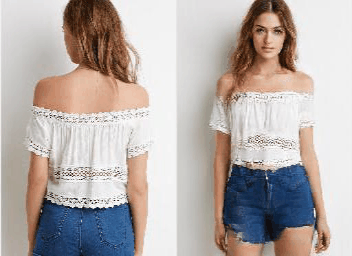
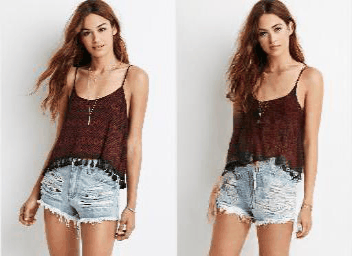
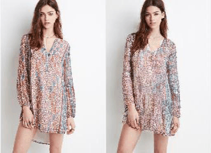
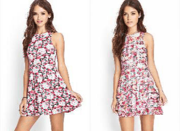
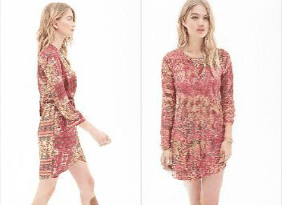
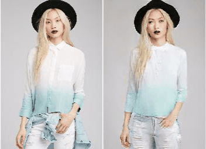

# Controllable Person Image Synthesis with Spatially-Adaptive Warped Normalization

Jichao Zhang, [Aliaksandr Siarohin](https://aliaksandrsiarohin.github.io/aliaksandr-siarohin-website/), [Hao Tang](https://scholar.google.com/citations?hl=en&user=9zJkeEMAAAAJ), Jingjing Chen, [Enver Sangineto](https://scholar.google.com/citations?user=eJZlvlAAAAAJ&hl=en), [Wei Wang](https://scholar.google.com/citations?user=k4SdlbcAAAAJ&hl=en), [Nicu Sebe](https://scholar.google.com/citations?user=tNtjSewAAAAJ&hl=en)

University of Trento, Zhejiang University

[Paper](https://arxiv.org/pdf/2105.14739.pdf) | [Demo Video](https://www.youtube.com/watch?v=PBK8ip7D5w4&t=2s) 

# Results 

## Pose Transfer

  
  
  
  
  
  

## Texture Transfer

  
  
  
  

# Code

Code will be published soon.

# Questions

If you have any questions/comments, feel free to open a github issue or pull a request or e-mail to the author Jichao Zhang (jichao.zhang@unitn.it).

