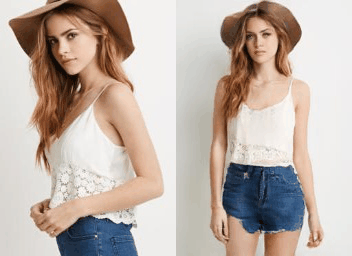
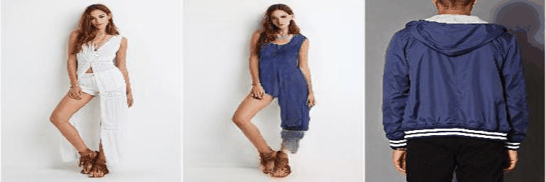

# Controllable Person Image Synthesis with Spatially-Adaptive Warped Normalization

Jichao Zhang, [Aliaksandr Siarohin](https://aliaksandrsiarohin.github.io/aliaksandr-siarohin-website/), [Hao Tang](https://scholar.google.com/citations?hl=en&user=9zJkeEMAAAAJ), [Enver Sangineto](https://scholar.google.com/citations?user=eJZlvlAAAAAJ&hl=en), [Wei Wang](https://scholar.google.com/citations?user=k4SdlbcAAAAJ&hl=en), [Humphrey Shi](https://scholar.google.com/citations?user=WBvt5A8AAAAJ&hl=en&oi=ao), [Nicu Sebe](https://scholar.google.com/citations?user=tNtjSewAAAAJ&hl=en)

University of Trento, ETH Zurich, Snap Research, University of Oregon

[Paper](https://arxiv.org/pdf/2105.14739.pdf) | [Demo Video](https://www.youtube.com/watch?v=PBK8ip7D5w4&t=2s) 

# Results 

## Pose Transfer

<p float="left">
  
  
  
  
  
  
</p>

## Texture Transfer

<p float="left">
  
  
  
  
</p>

## Environments

```
conda create -n Sawn python=3.6
```
```
pip install -r requirement.txt
```

## Training

First: pretraining flow-encoder
```
bash scripts/train_flowField.sh
```
Second: training Sawn for Pose-Transfer
```
bash scripts/train_Sawn.sh
```
Then: training STPR for Texture-Transfer
```
bash scripts/train_STPR.sh
```

## Pretrained Model and Results

To-do lists

# Questions

If you have any questions/comments, feel free to open a github issue or pull a request or e-mail to the author Jichao Zhang (jichao.zhang@unitn.it).


